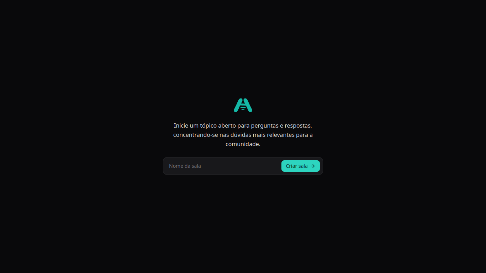
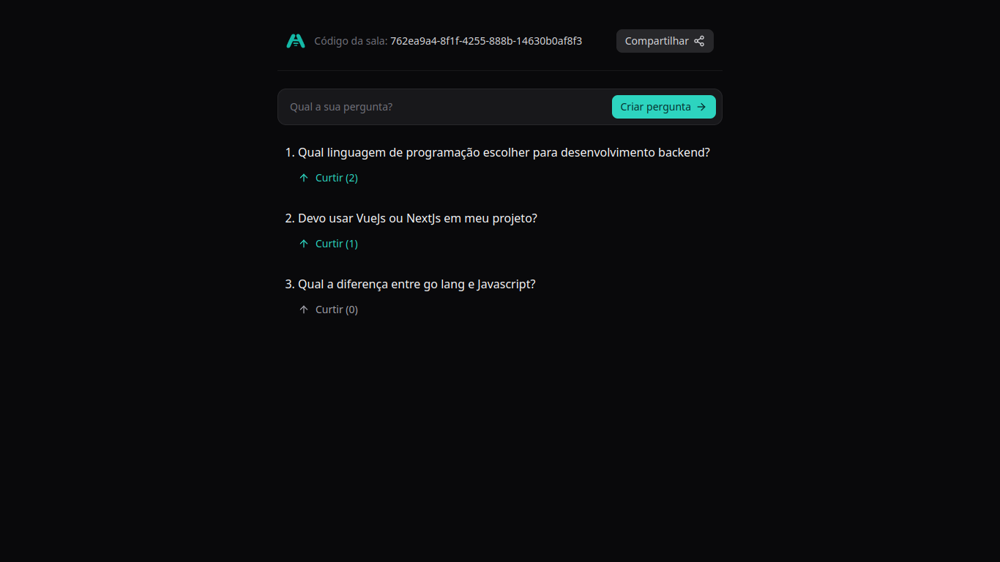

<h1 align="center"> <strong>📢 Ask the speaker</strong></h1>

<p align="center">


</p>

<h2 id="layout">🎨 Layout</h2>
<p align="center" >

  
  
</p>


<br />

# 📕 About
Public forum for questions and answers, prioritizing the most relevant issues for the community.

</br>

# 🛠️Technologies:
This project was made using the follow technologies:


[](https://skillicons.dev)


# 🚀Features

* Creation of interaction personalized rooms
* Creating messages within the personalized room
* Option to Like and Dislike posts in the room


# 🏃Getting Started


```sh
#  Clone Repository
$ git clone https://github.com/wesleywcr/ATS

# Backend
# Go to the project folder
$ cd ATS
$ cd api

# Install the dependencies
$ go mod tidy

# Docker and Docker Compose
$ docker compose up
$ docker compose start

# Run the application
$ go run cmd/wsrs/main.go 

# Frontend

# Go to the project folder
$ cd ATS
$ cd web

# Install Dependencies
$ npm install
# Start application
$ npm run dev
```

# 🤝 Contributing

- Fork this repository
- Create a branch with your feature: `git checkout -b my-feature`
- Commit your changes: `git commit -m 'feat: My new feature'`
- Push your branch: `git push origin my-feature`
# 

Released in 2024.
Made with ❤️ by [Wesley Rodrigues](https://github.com/wesleywcr)🤙👊
